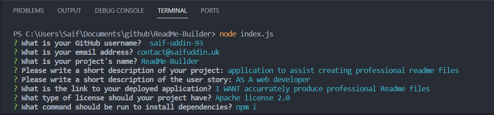

# Readme Builder

## Description

This project was created to create an application that generated a professional Readme markdown file based off the input by the user. The aim was to reduce the input required from the user be having the layout pre-filled with the correct markdown syntax and additional information depending on certain options that are selected. The project meets the following criteria:

* The application is able to produce a readme file called "generated readme.md" which is stored in the folder where the application is run from.
* The application has the option to choose different license options with T&C's pre-filled depending on the selected option.
* The Inquirer module is used to accept the user's input in the CLI.
* 

The main things I've learned from this project are:

* Gained an understanding of Node.js and how to add and run modules such as Inquirer.
* Learned how to import scripts and packages.


## Table of Contents

- [User Story](#user-story)
- [Installation](#installation)
- [Usage](#usage)
- [Credits](#credits)
- [License](#license)

## User Story

```md
AS A web developer
I WANT accurrately produce professional Readme files
SO THAT I can be sure to cover all aspects needed for my projects.
```

## Installation

For this project, the developer tool I'll be using is VS Code. A lightweight IDE that allows working in JavaScript. It also allows the use of Extensions which can add extra functionality to the tool to help with debugging and making code more readable. The main tool I'll be using is called, Node. Node allows the use of packages such as Inquirer and the ability to run JavaScript without the use of a browser.

## Usage

Once the application is run, the user will be prompted with a series of questions that are relevant to the different sections of the Readme. The answers the user inputs will be used to generate the final Readme file.

Screenshot of the final application:


[Link to video demo of application](https://www.youtube.com/watch?v=HEBn0g1VL4E)

The generated readme files are stored in the folder where the application is run.

## Credits

Assets in this project belong to the edX organisers. All JavaScript in this project was written by myself.

## License
### MIT License

Copyright (c) 2023 Saif-Uddin-93

Permission is hereby granted, free of charge, to any person obtaining a copy of this software and associated documentation files (the "Software"), to deal in the Software without restriction, including without limitation the rights to use, copy, modify, merge, publish, distribute, sublicense, and/or sell copies of the Software, and to permit persons to whom the Software is furnished to do so, subject to the following conditions:

The above copyright notice and this permission notice shall be included in all copies or substantial portions of the Software.

THE SOFTWARE IS PROVIDED "AS IS", WITHOUT WARRANTY OF ANY KIND, EXPRESS OR IMPLIED, INCLUDING BUT NOT LIMITED TO THE WARRANTIES OF MERCHANTABILITY, FITNESS FOR A PARTICULAR PURPOSE AND NONINFRINGEMENT. IN NO EVENT SHALL THE AUTHORS OR COPYRIGHT HOLDERS BE LIABLE FOR ANY CLAIM, DAMAGES OR OTHER LIABILITY, WHETHER IN AN ACTION OF CONTRACT, TORT OR OTHERWISE, ARISING FROM, OUT OF OR IN CONNECTION WITH THE SOFTWARE OR THE USE OR OTHER DEALINGS IN THE SOFTWARE.

## Badges

